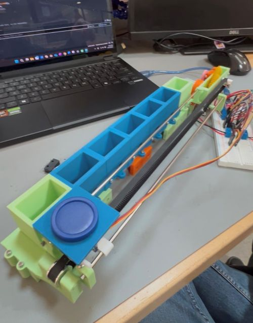
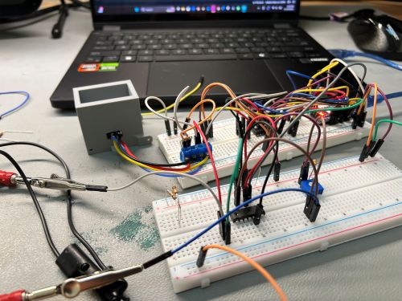

# Connect 4 Playing Robot (Ongoing)

**This project is currently under active development.**

An autonomous robot designed to play Connect 4 against a human opponent using piece sensing, game AI, and electromechanical actuation. 

## Project Goals
- Detect and map Connect 4 board state using sensors
- Implement game-playing AI using minimax algorithm and heuristics
- Physical PID actuation to place game pieces
- Enable human-vs-robot interface and gameplay

## Current Progress
**Completed:** 
- Mechanical design and PID controls
- Game logic and bitboard representation
- AI minimax algorithm, optimized C++ code on Raspberry Pi
- IR sensor circuitry & digital filtering for move detection
- Raspberry Pi and Arduino UART communication
- Full system integration

**In Progress / Unfinished:**
- Thorough testing
- Minimax heuristic NES optimization

**Planned Future Work:**
-  Custom PCB design
-  Design piece magazine and automatic loader for fully autonomous gameplay

## Code Structure
- `tests/` - Scripts used to for testing and debugging of various features, not documented
- `src/` - Contains all files used directly, files for compiling C++ code
- `src/old/` - Scripts and definitions no longer in use, old python implementations
- `src/External/arduino/` - Embedded Arduino C++ code for motor control and reading sensors
- `src/External/game_ai/` - Python-based Connect 4 game logic and minimax AI, including NES weight optimization algorithm

## Media
_Mechanical prototype. Click for video demo (11/13/2025)_

_Sensor circuitry prototyping (11/19/2025)_

## Status 
**Active development** - updated regularly. 
