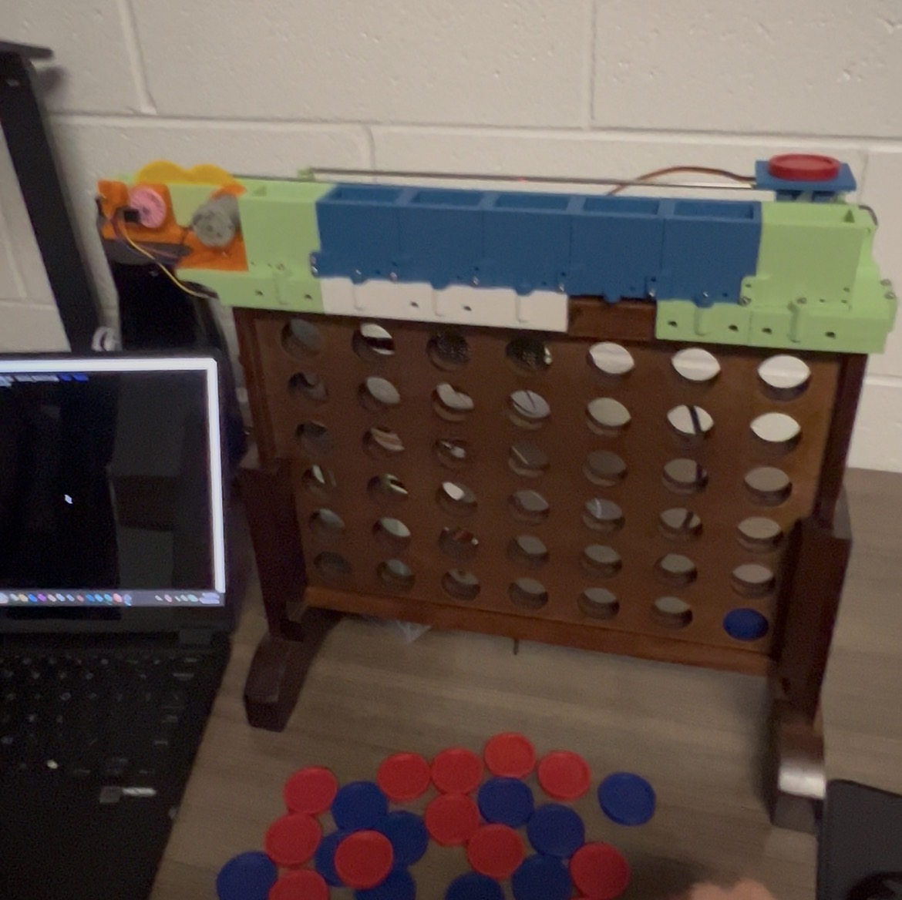
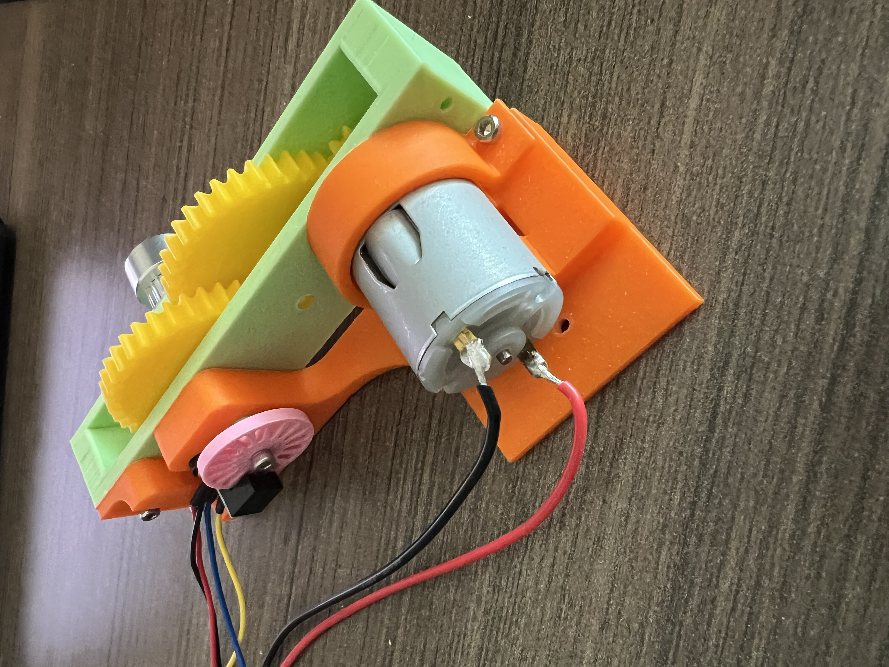
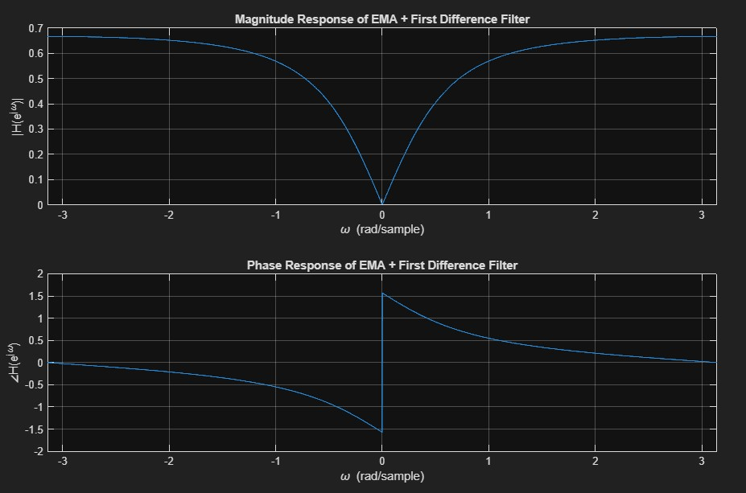
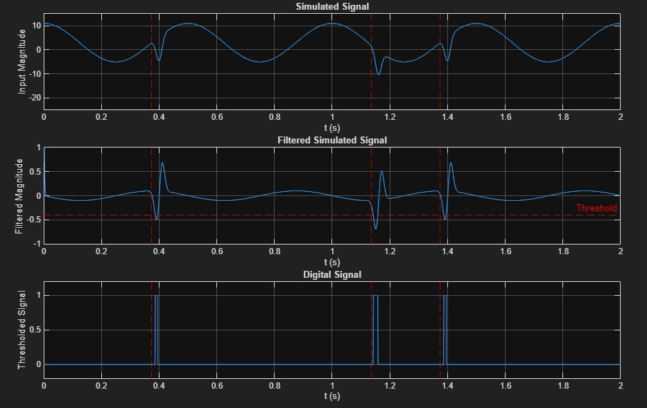
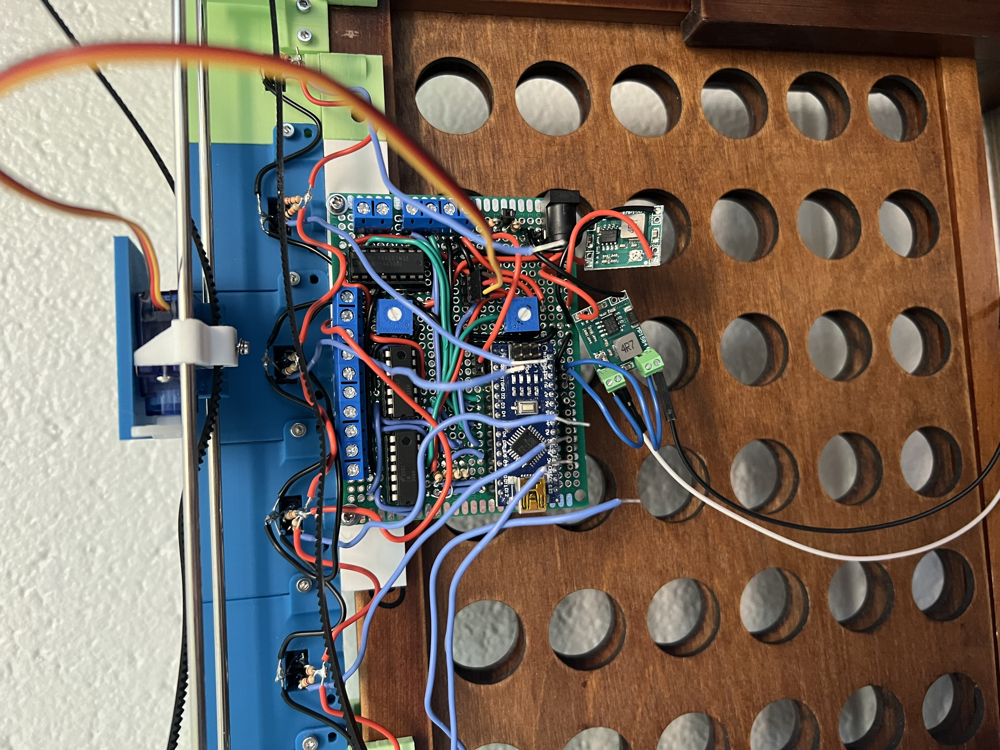
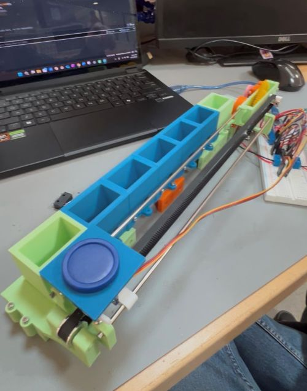
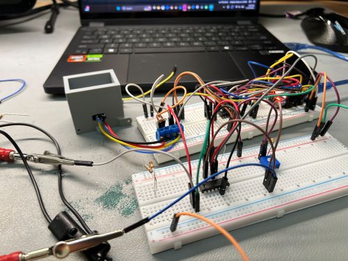

# Connect 4 Playing Robot

An autonomous robot designed to play Connect 4 against a human opponent using piece sensing, game AI, and electromechanical actuation. 

## Project Goals
- Detect and map Connect 4 board state using sensors
- Implement game-playing AI using minimax algorithm and heuristics
- Physical PID actuation to place game pieces
- Enable human-vs-robot interface and gameplay 

## How It Works

### Mechanical Design

The game piece delivery system consists of a two-part cart mechanism driven along the board using a GT2 timing belt. The cart is composed of:

* A freely rotating tray mounted on a single rod axis
* A servo-driven carriage that tilts the tray to release a game piece into a selected column funnel

The timing belt is driven by a low-cost DC motor coupled to a 25:1 gearbox, providing sufficient torque and positional precision for repeatable piece placement.

### Motion Control System

Because the drivetrain uses a low-cost brushed DC motor rather than a stepper motor, a custom closed-loop positioning system was developed.

A quadrature encoder with a 16-slot encoder wheel was mounted directly to the gearbox output shaft. Combined with PID position control, this provided approximately **0.625 mm positional resolution** for the cart.

The control loop runs on the Arduino Nano and continuously:

1. Reads encoder transitions
2. Computes cart position and velocity
3. Executes PID corrections
4. Adjusts motor drive signals in real time

This approach enabled accurate and repeatable alignment with each Connect-4 column despite drivetrain backlash and motor inconsistencies.

### Sensor Processing

Each column funnel contains an IR sensor used to detect when a game piece passes through the funnel.

The analog sensor signals are sampled directly by the Arduino ADC and processed through a digital signal-processing pipeline:

1. **Exponential Moving Average (EMA) filter** for high-frequency noise reduction
2. **First-difference filter** for edge detection

The filtered signals are thresholded to robustly detect piece insertion events.

Filter design and analysis were performed in MATLAB, including:

* Frequency response analysis
* Pole-zero analysis
* Sample signal filtering simulation

Relevant MATLAB scripts can be found in `src/External/filter/`.

### Game AI

Game states are represented using 64 bit unsigned integer bitboards for efficient memory and operation speed. 

The robot uses a pruned Minimax search algorithm with a linear board-state evaluation function to determine moves.

The game engine was written in optimized C++ and parallelized using multithreading to improve search throughput.

Key features include:

* Alpha-beta style pruning to reduce unnecessary branch exploration
* Dynamically adjusted search depth as the game tree shrinks
* Parallel branch traversal for improved performance on the Raspberry Pi

This implementation achieves a baseline search depth of **7 moves**, with deeper searches possible during later stages of gameplay.

### Embedded System Architecture

The robot is built around a distributed embedded architecture consisting of:

* Raspberry Pi for high-level game logic and AI
* Arduino Nano for real-time motor control and sensor processing
* Custom SN754410-based motor driver circuitry

The Raspberry Pi and Arduino communicate using a custom UART packet protocol.

Each packet consists of 4 bytes:

| Byte | Purpose         |
| ---- | --------------- |
| 1    | Start indicator |
| 2    | Command ID      |
| 3    | Argument/Data   |
| 4    | Checksum        |

This architecture separates high-level computation from timing-critical control tasks:

* The Arduino handles encoder decoding, PID control, sensor filtering, and actuator control
* The Raspberry Pi performs game-tree evaluation and strategic decision-making
* Commands and sensor events are exchanged through the UART protocol

This division allowed reliable real-time motion control while still supporting computationally intensive AI search algorithms.

### Software Stack

* C++: Game engine, Minimax implementation, multithreading
* Arduino C/C++: Embedded firmware and control systems
* MATLAB: DSP filter analysis and visualization
* Python: High-level Raspberry Pi integration utilities

### Engineering Focus Areas

This project involved substantial work in:

* Embedded systems design
* Closed-loop motor control
* Digital signal processing
* Multithreaded algorithm optimization
* Serial communication protocols
* Mechanical system integration
* Real-time robotics control
* Game AI development
* Custom electronics design
* System-level debugging and integration

## Code Structure
- `Connect4_Robot_main.py` - Main python file to run system
- `build.sh` - Compiles C++ code into `src/build/`, user must move .so file into `src/` once built
- `tests/` - Scripts used to for testing and debugging of various features, not documented
- `src/` - Contains all files used directly, files for compiling C++ code
- `src/old/` - Scripts and definitions no longer in use, old python implementations
- `src/External/arduino/` - Embedded Arduino C++ code for motor control and reading sensors
- `src/External/game_ai/` - Python-based Connect 4 game logic and minimax AI, including NES weight optimization algorithm
- `src/External/filter/` - MATLAB script for IR sensing filter frequency response, phase response, pole-zero, sample signal filtering analysis

## Status
**Completed:** 
- Mechanical design and PID controls
- Game logic and bitboard representation
- AI minimax algorithm, optimized threaded C++ code on Raspberry Pi
- IR sensor circuitry & digital filtering for move detection
- Raspberry Pi and Arduino UART communication
- Full system integration

**In Progress / Unfinished:**
- Minimax heuristic NES optimization

**Planned Future Work:**
-  Custom PCB design
-  Design piece magazine and automatic loader for fully autonomous gameplay

## Media
_Mechanical prototype. Click for video demo (11/13/2025)_

_Sensor circuitry prototyping (11/19/2025)_

